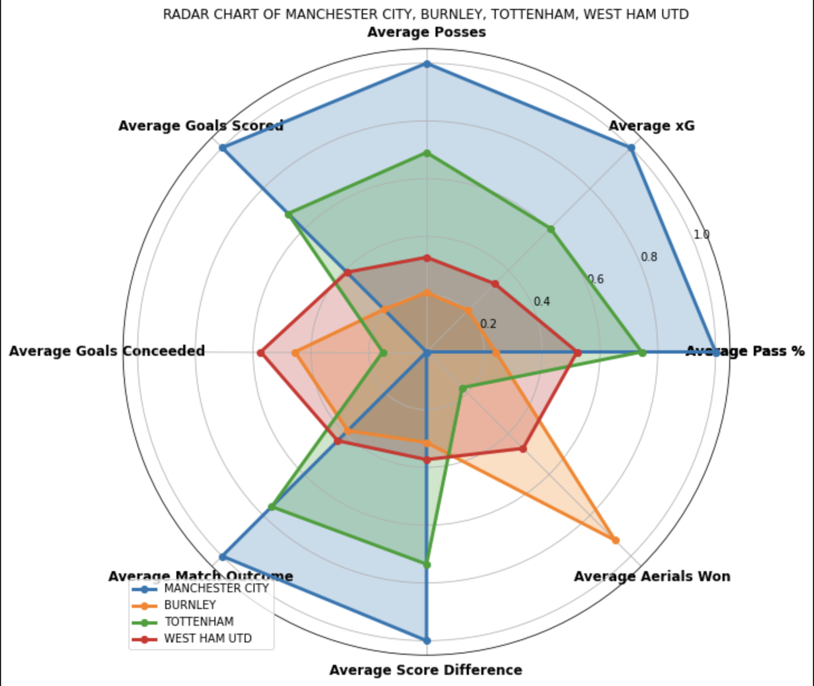

# Predictions Match Outcome

## Objectif

Le but de ce projet est de développer un modèle de prédiction de résultats de matchs de football en utilisant les données de matchs passés. Egalement essayé d'apprendre sur chaque équipe et déterminier les facteurs clés contribuant au résultat d'un match.

## Données

Les données utilisées sont les statistiques de matchs de football de la Premier League anglaise pour les saisons de 2016/2017 à 2020/2021. Les données ont été collectées à partir de deux bases de données. 
Les caractéristiques du 1er dataset comprennent les scores des matchs, les statistiques des équipes telles que la possession, les tirs et les cartons.
Le second dataset a surtout été utilisé pour avoir accès aux données expected goals (xG) et non-shot expected goals (NSxG) de chaque match.

## Prétraitement des données

Les données ont été nettoyées et préparées en vue de l'analyse en utilisant la bibliothèque pandas en Python. 
Les données ont été nettoyées pour enlever les valeurs manquantes, les valeurs aberrantes et les caractéristiques redondantes. 
Les caractéristiques ont été normalisées et encodées en utilisant une label numérique unique pour chaque équipe.

De nouvelles features ont été ajouté aux dataframe des matchs comme le classement et le nombre de chaque équipe du match sur la saison en cours. 
De plus, des features sur les performances des équipes sur les matchs précédents le match courant ont été créé pour avoir plus d'information sur la dynanmaique et l'état de forme des équipes.

## Visualisation

## Modélisation

Plusieurs modèles de machine learning ont été testés, notamment Random Forest, KNN, Logistic Regression et SVM. 
L'objectif est de prédire l'issue du match, à savoir la victoire de l'équipe à domicile, la victoire de l'équipe à l'extérieur ou le match nul.

## Évaluation du modèle

La performance de chaque modèle a été évaluée en utilisant la précision et la matrice de confusion. 
Pour garantir la validité du modèle, une validation croisée à séparation chronologique a été utilisée.

## Conclusion

Le modèle de Random Forest a donné les meilleurs résultats de prédiction avec une précision moyenne de 56%. 
Cela montre que les caractéristiques des équipes et les résultats passés peuvent être utilisés pour prédire avec une certaine précision les résultats futurs des matchs de football. 
Les résultats peuvent être améliorés en utilisant des données plus récentes et en incluant des caractéristiques supplémentaires telles que les blessures des joueurs, la forme récente des équipes et des joueurs dans d'autres championnats et les tactiques ou compositions d'équipes utilisés à chaque match.

### Critiques
Le football n'est pas une science exacte et un simple geste peut changer l'issue d'un match.
